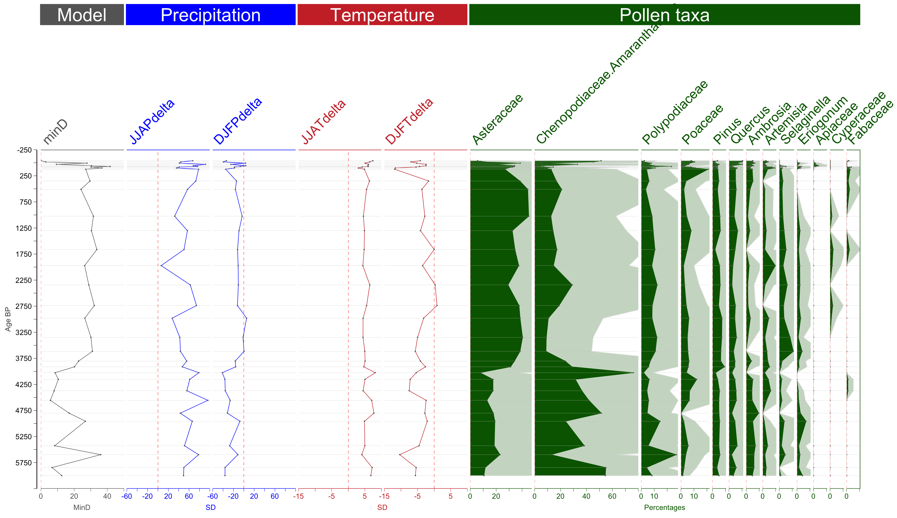

`r library(knitr)`
`r library(data.table)`
`r library(markdown)`
`r library(stratR)`
`r opts_chunk$set(cache=F)`

##Introduction

***  

This vignette illustrates, using practical examples, how to use the `stratR` 
package to construct stratigraphic diagrams of multiple variables. Variables in 
time-series datasets usually have large differences in statistical properties 
such as mean and range. This makes it difficult to plot such datasets in a way 
that is accurate, legible and that allows simultaneous comparison of all variables 
of interest. 

`stratR` uses R's `ggplot2` and `gridExtra` libraries to build high quality 
stratigraphic plots of multiple variables that are as well easily customisable. 
It takes care of the numerous fiddly details that would make buiding such a plot 
a nighmare and provides an intuitive interface from which key plotting parameters
can be modified easily. Plotting is done using the `stratPlot` function. For a 
complete list of the function's arguments and meanings, see its documentation 
with: `?strapPlot`.

***  

##Preparing your data
###Load and describe input data

Usually, raw data that is to be plotted or analysed in R will be in the [wide]()
format i.e., samples run row-wise and each measured variable is in its own column.
In this vignette, we'll work with a sample dataset that is originally in this format.
Below, we load and inspect a sample dataset included in `stratR` that has the 
described structure.
```{r}

#Read sample data
#Note that the read funtion used depends on the file type: text, excel, rds, etc
dat <- readRDS(file='data/sampleData.RDS')

#Print dimensions
dim(dat)
```

This dataset in particular contains 125 variables (columns) and 684 samples(rows)
We know what kind of data is in these columns a priori. For convinience, we can 
define these variable types as follows:
```{r}
#Metadata columns
metavars <- c('ids', 'entitynum', 'region', 'site',
              'londd', 'latdd', 'altitude', 'samplenum', 'agebp')

#Model output from some model
modvars <- "minD"
  
#Rainfall anomalies
precipvars <- c("JJAPdelta", "DJFPdelta")

#Temperature anomalies
tempvars <- c("JJATdelta", "DJFTdelta")

```

The rest of the columns, 670 in number, contain pollen percentages of 670 plant 
taxa that were observed at each sample. These would be too tideous to define manually
as done earlier with other variable types. Therefore, we can say that every variable
no already defined as metadata, model or climate variable is a pollen variable.

```{r}
#Pollen variables
pollvars <- names(dat)[!names(dat)%in%c(metavars, modvars, precipvars, tempvars)]
```

###Reshape to long format

`stratPlot` expects the input dataset to be in long format. Currently, our input
data is in the wide format. We need to "melt" it to long as follows.
```{r}
datL <- melt(data=dat, id.vars=metavars, variable.factor=F)
```

###Define variable groups
Finally, we need to define the variable types in the data by adding a new column
with grouping labels. This will determine how the different variables are treated 
as being similar and thus accorded the same plotting parameters or not.

```{r}
#Define variable groups
datL[variable%in%precipvars, group:='Precipitation']
datL[variable%in%tempvars, group:='Temperature']
datL[variable%in%modvars, group:='Model']
datL[variable%in%pollvars, group:='Pollen taxa']
```

The resulting data table now has:

- the original metadata columns

- a column named "variable" with the identities of all measured variables i.e., 
climate, pollen, model variables

- a column named "value" indicating the observed value for the respective measured
variable.

- a column named "group" indicating how the different variables are to be aggregated.

We can get a peek of our reshaped data by running:

```r{}
head(datL)
```

###Remove trace occurences
Since the pollen percentages in the dataset are occurence data, we might want to 
get rid of trace occurences e.g., by retaining only those pollen observations with
rates above a certain thresh-hold, say, 1%. We can also get rid of columns we do 
not wish to plot.
```{r}

#Subset pollen observations with rates equal to or above 1%
poll_dt <- subset(x=datL, variable%in%pollvars & value >=1)

#Fill every sample (time point) where a pollen variable was not observed with zero
poll_dt <- dcast(poll_dt,  ids + entitynum + 
                     region + site + londd + latdd + altitude +
                     samplenum + group + agebp ~ variable, value.var='value', fill=0)

#Drop columns with data we dont want to plot, e.g., ones that represent unknown pollen taxa
poll_dt[, NA.:=NULL]

#Reshape pollen data back into the long format
poll_dt <- melt(poll_dt, id.vars=c(metavars, 'group'))

#Remove variables in each entity that do not occur at least once
poll_dt[, n:=sum(value>0), .(entitynum, variable)]
poll_dt <- poll_dt[n>=1]
poll_dt[, n:=NULL]

```

Below, we subset combine the ready pollen data subset with the rest of the variables.
```{r}

#Subset other non-pollen data i.e. climate and model variables
oth_dt <- subset(x=datL, !variable%in%pollvars)

#Merge processed pollen data with the other non-pollen data
datL <- rbindlist(list(poll_dt, oth_dt), use.names=T)
```
*** 

##Plotting with `stratPlot`
`stratPlot` ingests a dataset of class `data.table` with the aforedescribed 
structure i.e., like `datL` and arguments to control how the output plot is built 
and styled. Details of `statPlot`'s arguments and their meanings can be viewed in 
the package's documentation with `?stratPlot`. Below are some examples illustrating 
the function's arguments and applications.

###Single plot
Our sample data currently contains data for 3 entities (pollen cores). The `ids` 
column contains the entity identifiers. To check what and how many entity ids are
in the dataset we can run:
```{r}
length(unique(datL[, ids]))  #Print number of unique entities
unique(datL[, ids])          #Print labels of unique entities
```

Below, we subset only the data from the entity 'Entity_8_Region_North America', 
which we'll use to generate a sample plot.
```{r}
datL_i <- subset(x=datL, ids=='Entity_8_Region_North America')
```

The code below generates a stratigraphic diagram of this data subset. See `?stratPlot`
for detailed information on what different arguments mean and do.

###{#wrapper}

```{r, echo=F}

#Build plot
plt_ls <- stratPlot(dat=datL_i,
                   tymcol='agebp', varcol='variable', valcol='value',
                   varord=c('med'),
                   grp_ord=c('Model', 'Precipitation', 'Temperature', 'Pollen taxa'),
                   grpcol='group',

                   grp_geom=c('line', 'line', 'line','area'),
                   grp_vartype=c('MinD', 'SD', 'SD','Percentages'),

                   #const_grps=c('Model', 'Precipitation', 'Temperature'),
                   grp_colours=c('grey40', 'blue', 'brown3','darkgreen'),

                   const_grps=c('Model', 'Precipitation', 'Temperature'), 
                   xbline=c(0, 0, 0, 0),
                   xbrkint=c(NA, NA, NA, 10),
                   ybrkint=NA,

                   axs_tsize=10, var_tsize=18, grp_tsize=25, ptt_tsize=20,

                   plab='', ylab='Age BP',
                   pmargin=unit(c(0.05, 0, 0.1, 0), 'cm'),
                   maxw=5
                  )

#Get plot object
plot_obj <- plt_ls$plot

#Get plot width (in cm)
plot_width <- plt_ls$width

#Save plot to file
ggsave(filename='data/p1.png', plot=plot_obj,
       limitsize=F, width=plot_width, height=25, units='cm')
```

###{#wrapper}

